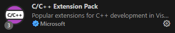

# vscode的c++环境配置

    本文选择vscode + msys2 + cmake + clangd的配置

## 1. 需要安装的东西

* vscode 官网下载安装即可
* msys2 官网下载安装即可

## 2. msys2配置

1. msys2的版本选择

    msys2有很多个子环境，一般选择UCRT64比较好
    
    

2. 安装minGW64

    ~~~
    pacman -S mingw-w64-ucrt-x86_64-toolchain
    ~~~

3. 安装CMake+ninja
    ninja可以加速编译
    ~~~
    pacman -S mingw-w64-ucrt-x86_64-cmake
    pacman -S mingw-w64-ucrt-x86_64-ninja
    ~~~

4. 将msys2添加到path变量（*这样后文的vscode的c++相关的插件安装之后无需进行任何额外的设置即可*）

    

## 3. vscode需要安装的插件及其配置

1. vscodevs安装clangd、CMake Tools和C/C++ Extension Pack插件

    

2. CMake Tools配置

    * 配置如下图选项（如果msys2已经添加到环境变量则无需配置此项）
    
        

    * 配置如下图选项（如果msys2已经添加到环境变量则无需配置此项）

        

3. C/C++ Extension Pack配置

    该插件是一个整合包，主要需要配置的是c++ tools，关于各个选项的官方文档：https://code.visualstudio.com/docs/cpp/c-cpp-properties-schema-reference

    * 如果需要使用cpp-tools的inlellisense则需要将`configurationProvider`设置成`ms-vscode.cmake-tools`

4. clangd配置

    * 代码静态分析相关的设置
        clangd需要设置你使用的编译器的位置、compile_command.json的位置以及一些其他的设置，如下图

        

        生成compile_command.json需要在CMakeLists.txt中新增`set(CMAKE_EXPORT_COMPILE_COMMANDS ON)`

        可以设置针对整个clangd的配置文件，配置文件位置：`Windows: %LocalAppData%\clangd\config.yaml`，以下内容为clion的配置，被注释掉的三个选项是clion特有的。
        ~~~
        #User config
        Diagnostics:
        UnusedIncludes: Strict
        ClangTidy:
            Add:
            [
                # performance-*,
                # bugprone-*,
                # modernize-*,
                # clang-analyzer-*,
                # readability-identifier*,
                bugprone-argument-comment,
                bugprone-assert-side-effect,
                bugprone-bad-signal-to-kill-thread,
                bugprone-branch-clone,
                bugprone-copy-constructor-init,
                bugprone-dangling-handle,
                bugprone-dynamic-static-initializers,
                bugprone-fold-init-type,
                bugprone-forward-declaration-namespace,
                bugprone-forwarding-reference-overload,
                bugprone-inaccurate-erase,
                bugprone-incorrect-roundings,
                bugprone-integer-division,
                bugprone-lambda-function-name,
                bugprone-macro-parentheses,
                bugprone-macro-repeated-side-effects,
                bugprone-misplaced-operator-in-strlen-in-alloc,
                bugprone-misplaced-pointer-arithmetic-in-alloc,
                bugprone-misplaced-widening-cast,
                bugprone-move-forwarding-reference,
                bugprone-multiple-statement-macro,
                bugprone-narrowing-conversions,
                bugprone-no-escape,
                bugprone-not-null-terminated-result,
                bugprone-parent-virtual-call,
                bugprone-posix-return,
                bugprone-reserved-identifier,
                bugprone-sizeof-container,
                bugprone-sizeof-expression,
                bugprone-string-constructor,
                bugprone-string-integer-assignment,
                bugprone-string-literal-with-embedded-nul,
                bugprone-suspicious-enum-usage,
                bugprone-suspicious-include,
                bugprone-suspicious-memory-comparison,
                bugprone-suspicious-memset-usage,
                bugprone-suspicious-missing-comma,
                bugprone-suspicious-semicolon,
                bugprone-suspicious-string-compare,
                bugprone-swapped-arguments,
                bugprone-terminating-continue,
                bugprone-throw-keyword-missing,
                bugprone-too-small-loop-variable,
                bugprone-undefined-memory-manipulation,
                bugprone-undelegated-constructor,
                bugprone-unhandled-self-assignment,
                bugprone-unused-raii,
                bugprone-unused-return-value,
                bugprone-use-after-move,
                bugprone-virtual-near-miss,
                boost-use-to-string,
                cert-dcl03-c,
                cert-dcl21-cpp,
                cert-dcl58-cpp,
                cert-err34-c,
                cert-err52-cpp,
                cert-err58-cpp,
                cert-err60-cpp,
                cert-flp30-c,
                cert-msc50-cpp,
                cert-msc51-cpp,
                cert-oop54-cpp,
                cert-str34-c,
                cppcoreguidelines-interfaces-global-init,
                cppcoreguidelines-narrowing-conversions,
                cppcoreguidelines-pro-type-member-init,
                cppcoreguidelines-pro-type-static-cast-downcast,
                cppcoreguidelines-slicing,
                google-default-arguments,
                google-explicit-constructor,
                google-runtime-operator,
                hicpp-exception-baseclass,
                hicpp-multiway-paths-covered,
                hicpp-signed-bitwise,
                misc-misplaced-const,
                misc-new-delete-overloads,
                misc-no-recursion,
                misc-non-copyable-objects,
                misc-redundant-expression,
                misc-static-assert,
                misc-throw-by-value-catch-by-reference,
                misc-unconventional-assign-operator,
                misc-uniqueptr-reset-release,
                modernize-avoid-bind,
                modernize-concat-nested-namespaces,
                modernize-deprecated-headers,
                modernize-deprecated-ios-base-aliases,
                modernize-loop-convert,
                modernize-make-shared,
                modernize-make-unique,
                modernize-pass-by-value,
                modernize-raw-string-literal,
                modernize-redundant-void-arg,
                modernize-replace-auto-ptr,
                modernize-replace-disallow-copy-and-assign-macro,
                modernize-replace-random-shuffle,
                modernize-return-braced-init-list,
                modernize-shrink-to-fit,
                modernize-unary-static-assert,
                modernize-use-auto,
                modernize-use-bool-literals,
                modernize-use-emplace,
                modernize-use-equals-default,
                modernize-use-equals-delete,
                modernize-use-nodiscard,
                modernize-use-noexcept,
                modernize-use-nullptr,
                modernize-use-override,
                modernize-use-transparent-functors,
                modernize-use-uncaught-exceptions,
                #mpi-buffer-deref,
                #mpi-type-mismatch,
                openmp-use-default-none,
                performance-faster-string-find,
                performance-for-range-copy,
                performance-implicit-conversion-in-loop,
                performance-inefficient-algorithm,
                performance-inefficient-string-concatenation,
                performance-inefficient-vector-operation,
                performance-move-const-arg,
                performance-move-constructor-init,
                performance-no-automatic-move,
                performance-noexcept-move-constructor,
                performance-trivially-destructible,
                performance-type-promotion-in-math-fn,
                performance-unnecessary-copy-initialization,
                performance-unnecessary-value-param,
                portability-simd-intrinsics,
                readability-avoid-const-params-in-decls,
                readability-const-return-type,
                readability-container-size-empty,
                readability-convert-member-functions-to-static,
                readability-delete-null-pointer,
                #readability-deleted-default,
                readability-inconsistent-declaration-parameter-name,
                readability-make-member-function-const,
                readability-misleading-indentation,
                readability-misplaced-array-index,
                readability-non-const-parameter,
                readability-redundant-control-flow,
                readability-redundant-declaration,
                readability-redundant-function-ptr-dereference,
                readability-redundant-smartptr-get,
                readability-redundant-string-cstr,
                readability-redundant-string-init,
                readability-simplify-subscript-expr,
                readability-static-accessed-through-instance,
                readability-static-definition-in-anonymous-namespace,
                readability-string-compare,
                readability-uniqueptr-delete-release,
                readability-use-anyofallof,
            ]
            CheckOptions:
            readability-identifier-naming.VariableCase: camelCase
        ~~~
    
    * clang-format相关的设置

        注意：需要将clang和clang-format的路径添加到系统的环境变量才可以在windows的命令行执行命令。

        在命令行执行`clang-format -style=Google -dump-config > .clang-format`则可以生成Google风格的代码样式。生成后必须将其编码变成UTF8才可以正常的使用该文件。

        Google风格的.clang-tidy模板如下
        ~~~
        ---
        Language:        Cpp
        # BasedOnStyle:  Google
        AccessModifierOffset: -1
        AlignAfterOpenBracket: Align
        AlignArrayOfStructures: None
        AlignConsecutiveAssignments:
        Enabled:         false
        AcrossEmptyLines: false
        AcrossComments:  false
        AlignCompound:   false
        PadOperators:    true
        AlignConsecutiveBitFields:
        Enabled:         false
        AcrossEmptyLines: false
        AcrossComments:  false
        AlignCompound:   false
        PadOperators:    false
        AlignConsecutiveDeclarations:
        Enabled:         false
        AcrossEmptyLines: false
        AcrossComments:  false
        AlignCompound:   false
        PadOperators:    false
        AlignConsecutiveMacros:
        Enabled:         false
        AcrossEmptyLines: false
        AcrossComments:  false
        AlignCompound:   false
        PadOperators:    false
        AlignConsecutiveShortCaseStatements:
        Enabled:         false
        AcrossEmptyLines: false
        AcrossComments:  false
        AlignCaseColons: false
        AlignEscapedNewlines: Left
        AlignOperands:   Align
        AlignTrailingComments:
        Kind:            Always
        OverEmptyLines:  0
        AllowAllArgumentsOnNextLine: true
        AllowAllParametersOfDeclarationOnNextLine: true
        AllowShortBlocksOnASingleLine: Never
        AllowShortCaseLabelsOnASingleLine: false
        AllowShortEnumsOnASingleLine: true
        AllowShortFunctionsOnASingleLine: All
        AllowShortIfStatementsOnASingleLine: WithoutElse
        AllowShortLambdasOnASingleLine: All
        AllowShortLoopsOnASingleLine: true
        AlwaysBreakAfterDefinitionReturnType: None
        AlwaysBreakAfterReturnType: None
        AlwaysBreakBeforeMultilineStrings: true
        AlwaysBreakTemplateDeclarations: Yes
        AttributeMacros:
        - __capability
        BinPackArguments: true
        BinPackParameters: true
        BitFieldColonSpacing: Both
        BraceWrapping:
        AfterCaseLabel:  false
        AfterClass:      false
        AfterControlStatement: Never
        AfterEnum:       false
        AfterExternBlock: false
        AfterFunction:   false
        AfterNamespace:  false
        AfterObjCDeclaration: false
        AfterStruct:     false
        AfterUnion:      false
        BeforeCatch:     false
        BeforeElse:      false
        BeforeLambdaBody: false
        BeforeWhile:     false
        IndentBraces:    false
        SplitEmptyFunction: true
        SplitEmptyRecord: true
        SplitEmptyNamespace: true
        BreakAfterAttributes: Never
        BreakAfterJavaFieldAnnotations: false
        BreakArrays:     true
        BreakBeforeBinaryOperators: None
        BreakBeforeConceptDeclarations: Always
        BreakBeforeBraces: Attach
        BreakBeforeInlineASMColon: OnlyMultiline
        BreakBeforeTernaryOperators: true
        BreakConstructorInitializers: BeforeColon
        BreakInheritanceList: BeforeColon
        BreakStringLiterals: true
        ColumnLimit:     80
        CommentPragmas:  '^ IWYU pragma:'
        CompactNamespaces: false
        ConstructorInitializerIndentWidth: 4
        ContinuationIndentWidth: 4
        Cpp11BracedListStyle: true
        DerivePointerAlignment: true
        DisableFormat:   false
        EmptyLineAfterAccessModifier: Never
        EmptyLineBeforeAccessModifier: LogicalBlock
        ExperimentalAutoDetectBinPacking: false
        FixNamespaceComments: true
        ForEachMacros:
        - foreach
        - Q_FOREACH
        - BOOST_FOREACH
        IfMacros:
        - KJ_IF_MAYBE
        IncludeBlocks:   Regroup
        IncludeCategories:
        - Regex:           '^<ext/.*\.h>'
            Priority:        2
            SortPriority:    0
            CaseSensitive:   false
        - Regex:           '^<.*\.h>'
            Priority:        1
            SortPriority:    0
            CaseSensitive:   false
        - Regex:           '^<.*'
            Priority:        2
            SortPriority:    0
            CaseSensitive:   false
        - Regex:           '.*'
            Priority:        3
            SortPriority:    0
            CaseSensitive:   false
        IncludeIsMainRegex: '([-_](test|unittest))?$'
        IncludeIsMainSourceRegex: ''
        IndentAccessModifiers: false
        IndentCaseBlocks: false
        IndentCaseLabels: true
        IndentExternBlock: AfterExternBlock
        IndentGotoLabels: true
        IndentPPDirectives: None
        IndentRequiresClause: true
        IndentWidth:     2
        IndentWrappedFunctionNames: false
        InsertBraces:    false
        InsertNewlineAtEOF: false
        InsertTrailingCommas: None
        IntegerLiteralSeparator:
        Binary:          0
        BinaryMinDigits: 0
        Decimal:         0
        DecimalMinDigits: 0
        Hex:             0
        HexMinDigits:    0
        JavaScriptQuotes: Leave
        JavaScriptWrapImports: true
        KeepEmptyLinesAtTheStartOfBlocks: false
        KeepEmptyLinesAtEOF: false
        LambdaBodyIndentation: Signature
        LineEnding:      DeriveLF
        MacroBlockBegin: ''
        MacroBlockEnd:   ''
        MaxEmptyLinesToKeep: 1
        NamespaceIndentation: None
        ObjCBinPackProtocolList: Never
        ObjCBlockIndentWidth: 2
        ObjCBreakBeforeNestedBlockParam: true
        ObjCSpaceAfterProperty: false
        ObjCSpaceBeforeProtocolList: true
        PackConstructorInitializers: NextLine
        PenaltyBreakAssignment: 2
        PenaltyBreakBeforeFirstCallParameter: 1
        PenaltyBreakComment: 300
        PenaltyBreakFirstLessLess: 120
        PenaltyBreakOpenParenthesis: 0
        PenaltyBreakString: 1000
        PenaltyBreakTemplateDeclaration: 10
        PenaltyExcessCharacter: 1000000
        PenaltyIndentedWhitespace: 0
        PenaltyReturnTypeOnItsOwnLine: 200
        PointerAlignment: Left
        PPIndentWidth:   -1
        QualifierAlignment: Leave
        RawStringFormats:
        - Language:        Cpp
            Delimiters:
            - cc
            - CC
            - cpp
            - Cpp
            - CPP
            - 'c++'
            - 'C++'
            CanonicalDelimiter: ''
            BasedOnStyle:    google
        - Language:        TextProto
            Delimiters:
            - pb
            - PB
            - proto
            - PROTO
            EnclosingFunctions:
            - EqualsProto
            - EquivToProto
            - PARSE_PARTIAL_TEXT_PROTO
            - PARSE_TEST_PROTO
            - PARSE_TEXT_PROTO
            - ParseTextOrDie
            - ParseTextProtoOrDie
            - ParseTestProto
            - ParsePartialTestProto
            CanonicalDelimiter: pb
            BasedOnStyle:    google
        ReferenceAlignment: Pointer
        ReflowComments:  true
        RemoveBracesLLVM: false
        RemoveParentheses: Leave
        RemoveSemicolon: false
        RequiresClausePosition: OwnLine
        RequiresExpressionIndentation: OuterScope
        SeparateDefinitionBlocks: Leave
        ShortNamespaceLines: 1
        SortIncludes:    CaseSensitive
        SortJavaStaticImport: Before
        SortUsingDeclarations: LexicographicNumeric
        SpaceAfterCStyleCast: false
        SpaceAfterLogicalNot: false
        SpaceAfterTemplateKeyword: true
        SpaceAroundPointerQualifiers: Default
        SpaceBeforeAssignmentOperators: true
        SpaceBeforeCaseColon: false
        SpaceBeforeCpp11BracedList: false
        SpaceBeforeCtorInitializerColon: true
        SpaceBeforeInheritanceColon: true
        SpaceBeforeJsonColon: false
        SpaceBeforeParens: ControlStatements
        SpaceBeforeParensOptions:
        AfterControlStatements: true
        AfterForeachMacros: true
        AfterFunctionDefinitionName: false
        AfterFunctionDeclarationName: false
        AfterIfMacros:   true
        AfterOverloadedOperator: false
        AfterRequiresInClause: false
        AfterRequiresInExpression: false
        BeforeNonEmptyParentheses: false
        SpaceBeforeRangeBasedForLoopColon: true
        SpaceBeforeSquareBrackets: false
        SpaceInEmptyBlock: false
        SpacesBeforeTrailingComments: 2
        SpacesInAngles:  Never
        SpacesInContainerLiterals: true
        SpacesInLineCommentPrefix:
        Minimum:         1
        Maximum:         -1
        SpacesInParens:  Never
        SpacesInParensOptions:
        InCStyleCasts:   false
        InConditionalStatements: false
        InEmptyParentheses: false
        Other:           false
        SpacesInSquareBrackets: false
        Standard:        Auto
        StatementAttributeLikeMacros:
        - Q_EMIT
        StatementMacros:
        - Q_UNUSED
        - QT_REQUIRE_VERSION
        TabWidth:        8
        UseTab:          Never
        VerilogBreakBetweenInstancePorts: true
        WhitespaceSensitiveMacros:
        - BOOST_PP_STRINGIZE
        - CF_SWIFT_NAME
        - NS_SWIFT_NAME
        - PP_STRINGIZE
        - STRINGIZE
        ...

        ~~~

## 4. vscode的tasks.json和launch.json配置

    如果要使用CMakeLists.txt来定义项目的话，使用右上角的运行或者调试按钮就会报错，因为右上角的运行或者调试按钮是用tasks.json和launch.json决定的，所以需要进行特殊的配置。（如果使用下方的状态栏的CMake Tools的调试和运行按钮就不会有问题）

1. tasks.json和launch.json的作用

    * tasks.json是用来写编译链接之类的命令行命令的，在里面先写好后回自动进行运行。每一条命名都需要进行配置。
    * launch.json决定使用哪个task的文件，对于c++来说，它决定了点击右上角的运行后的“选择调试器”下面的内容。 

2. 使用CMake时tasks.json的配置

    着重要配置的是tasks下面的“type”、“label”、“args”、“options”字段的内容，其详细含义见下文的Json代码注释。

    ~~~
    {
        "version": "2.0.0",
        "tasks": [
            {
                //这一个命令的类型，CMake命令填的是shell
                "type": "shell", 
                //这一条命令的识别符号，可以随便使用，是其他的task或者launch.json里面用来识别这条命令的标识符
                "label": "cmake", 
                //填的是用来执行你写的这个命令的程序的地址，如果环境变量没有添加则要写绝对地址
                "command": "D:\\FtpFile\\msys64-gcc11.3-qt5.15.3-20220712\\msys64-tmp\\mingw64\\bin\\cmake.EXE",
                //具体的配置内容，就是你在cmake的命令行里面执行什么这里就写什么
                //要安装空格分开，每个空格在这里都是一行
                "args": [
                    "--build",
                    "d:/TempSrc/cpp_code/simodel/build",
                    "--config",
                    "Debug",
                    "--target",
                    "all",
                    "-j",
                    "22"
                ],
                "options": {
                    //执行命令的位置，也就是在执行你上面所定义的命令之前会切换当前目录到cwd里面
                    "cwd": "${workspaceFolder}/build"
                },
                "problemMatcher": [],
                "group": {
                    "kind": "build",
                    "isDefault": true
                }
            }
        ]
    }
    ~~~

3. 使用CMake时launch.json的配置

    根据vscode的CMake Tools的官网，这里使用了替换命令的方式，主要用到的会写在下面
   
    ~~~
    {
        "version": "0.2.0",
        "configurations": [
            {
                //配置的名字，随便写
                "name": "使用cmake调试或者运行",
                //这个是固定的，c++就是cppdbg
                "type": "cppdbg",
                "request": "launch",
                //这里填的是可执行的文件的地址，因为可执行文件由写在tasks里面的cmake命令生成，所以这里用到了替换
                "program": "${command:cmake.launchTargetPath}",
                "args": [],
                "stopAtEntry": false,
                "cwd": "${workspaceFolder}",
                "environment": [
                    {
                        // add the directory where our target was built to the PATHs
                        // it gets resolved by CMake Tools:
                        "name": "PATH",
                        "value": "${env:PATH}:${command:cmake.getLaunchTargetDirectory}"
                    }
                ],
                "externalConsole": false,
                "MIMode": "gdb",
                "setupCommands": [
                    {
                        "description": "为 gdb 启用整齐打印",
                        "text": "-enable-pretty-printing",
                        "ignoreFailures": true
                    },
                    {
                        "description": "将反汇编风格设置为 Intel",
                        "text": "-gdb-set disassembly-flavor intel",
                        "ignoreFailures": true
                    }
                ],
                //这里就是填tasks.json里面的label，用哪个就填哪个
                "preLaunchTask": "cmake"
            }
        ]
    }
    ~~~