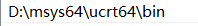
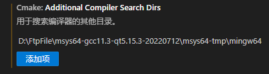
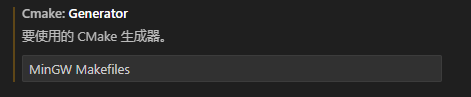

# vscode配置cmake和msys2的环境

## 1. 需要安装的东西

* vscode 官网下载安装即可
* msys2 官网下载安装即可

## 2. msys2配置

1. msys2的版本选择

    msys2有很多个子环境，一般选择UCRT64比较好
    
    

2. 安装minGW64

    ~~~
    pacman -S mingw-w64-ucrt-x86_64-toolchain
    ~~~

3. 安装CMake+ninja
    ninja可以加速编译
    ~~~
    pacman -S mingw-w64-ucrt-x86_64-cmake
    pacman -S mingw-w64-ucrt-x86_64-ninja
    ~~~

4. 将msys2添加到path变量（*这样后文的vscode的c++相关的插件安装之后无需进行任何额外的设置即可*）

    

## 3. vscode需要安装的插件及其配置

1. vscodevs安装CMake Tools和C/C++ Extension Pack插件

    

2. CMake Tools配置

    配置如下图选项
    
    

    以及如下图选项

    

3. C/C++ Extension Pack配置

    该插件无需要手动配置，会自动进行配置的

## 4. vscode的tasks.json和launch.json配置

    如果要使用CMakeLists.txt来定义项目的话，使用右上角的运行或者调试按钮就会报错，因为右上角的运行或者调试按钮是用tasks.json和launch.json决定的，所以需要进行特殊的配置。（如果使用下方的状态栏的CMake Tools的调试和运行按钮就不会有问题）

1. tasks.json和launch.json的作用

    * tasks.json是用来写编译链接之类的命令行命令的，在里面先写好后回自动进行运行。每一条命名都需要进行配置。
    * launch.json决定使用哪个task的文件，对于c++来说，它决定了点击右上角的运行后的“选择调试器”下面的内容。 

2. 使用CMake时tasks.json的配置

    着重要配置的是tasks下面的“type”、“label”、“args”、“options”字段的内容，其详细含义见下文的Json代码注释。

    ~~~
    {
        "version": "2.0.0",
        "tasks": [
            {
                //这一个命令的类型，CMake命令填的是shell
                "type": "shell", 
                //这一条命令的识别符号，可以随便使用，是其他的task或者launch.json里面用来识别这条命令的标识符
                "label": "cmake", 
                //填的是用来执行你写的这个命令的程序的地址，如果环境变量没有添加则要写绝对地址
                "command": "D:\\FtpFile\\msys64-gcc11.3-qt5.15.3-20220712\\msys64-tmp\\mingw64\\bin\\cmake.EXE",
                //具体的配置内容，就是你在cmake的命令行里面执行什么这里就写什么
                //要安装空格分开，每个空格在这里都是一行
                "args": [
                    "--build",
                    "d:/TempSrc/cpp_code/simodel/build",
                    "--config",
                    "Debug",
                    "--target",
                    "all",
                    "-j",
                    "22"
                ],
                "options": {
                    //执行命令的位置，也就是在执行你上面所定义的命令之前会切换当前目录到cwd里面
                    "cwd": "${workspaceFolder}/build"
                },
                "problemMatcher": [],
                "group": {
                    "kind": "build",
                    "isDefault": true
                }
            }
        ]
    }
    ~~~

3. 使用CMake时launch.json的配置

    根据vscode的CMake Tools的官网，这里使用了替换命令的方式，主要用到的会写在下面
   
    ~~~
    {
        "version": "0.2.0",
        "configurations": [
            {
                //配置的名字，随便写
                "name": "使用cmake调试或者运行",
                //这个是固定的，c++就是cppdbg
                "type": "cppdbg",
                "request": "launch",
                //这里填的是可执行的文件的地址，因为可执行文件由写在tasks里面的cmake命令生成，所以这里用到了替换
                "program": "${command:cmake.launchTargetPath}",
                "args": [],
                "stopAtEntry": false,
                "cwd": "${workspaceFolder}",
                "environment": [
                    {
                        // add the directory where our target was built to the PATHs
                        // it gets resolved by CMake Tools:
                        "name": "PATH",
                        "value": "${env:PATH}:${command:cmake.getLaunchTargetDirectory}"
                    }
                ],
                "externalConsole": false,
                "MIMode": "gdb",
                "setupCommands": [
                    {
                        "description": "为 gdb 启用整齐打印",
                        "text": "-enable-pretty-printing",
                        "ignoreFailures": true
                    },
                    {
                        "description": "将反汇编风格设置为 Intel",
                        "text": "-gdb-set disassembly-flavor intel",
                        "ignoreFailures": true
                    }
                ],
                //这里就是填tasks.json里面的label，用哪个就填哪个
                "preLaunchTask": "cmake"
            }
        ]
    }
    ~~~